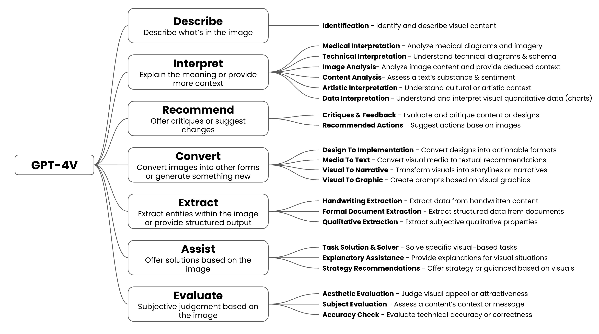

# GPT-4V is blowing my mind

> [Reference](https://x.com/GregKamradt/status/1711772496159252981)

The demos are awesome, but too scattered

I wanted to break down the 100+ use cases I've seen so far into a simple framework

Check out what I found with full descriptions and examples.

Agree or disagree with the categories?

Use Case Breakdown w/ Examples:
1. Describe - Simply describing what is in an image
* Animal Identification: https://x.com/helghardt/stat/Helghardt/status/1709485359887794486
* What's in this photo?: https://x.com/suraj_biniwale/suraj_biniwale/status/1709567196274548984

2. Interpret - The biggest of the lot, explain the meaning and provide more context behind an image. This is the layer deeper than a surface level description.
* Technical Flame Graph Interpretation: https://x.com/cto_junior/status/1711067515600646585?s=46
* Schematic Interpretation: https://x.com/brianroemmele/status/1710835622842360201?s=46
* Twitter Thread Explainer: https://x.com/ultrarareaf/st/UltraRareAF/status/1710270517364867203

3. Recommend - Offer critiques, suggested changes, or recommendations based off an image
* Food Recommendations: https://x.com/rachel_l_woods/status/1710708040226226564?s=20
* Website Feedback (a bunch of these): https://x.com/ammaar/status//ammaar/status/1709430616524259445
* Painting Feedback: https://x.com/marissamary/st/marissamary/status/1707147314660270588

4. Convert - Convert images into other forms (code, narrative, etc.) or generate something new. Massive opportunity to build a ton of product here. Major things to come
* Figma Screens > Code: https://x.com/mckaywrigley/s/mckaywrigley/status/1707796170905661761
* Adobe Lightroom Settings: https://x.com/skirano/status/skirano/status/1709333011135681012
* Suggest ad copy based on a webpage: https://x.com/ijatajiji/stat/ijatajiji/status/1710199020499726535

5. Extract - Extract entities within an image or provide structured output
* Structured Data From Driver's License: https://x.com/abacaj/status/1710525260578410754?s=46
* Extract structured items from an image: https://x.com/mckaywrigley/s/mckaywrigley/status/1708557028149673990
* Handwriting Extraction: https://x.com/brianroemmele/status/1710392068772872333?s=46

6. Assist - Offer solutions based on the image
* Excel Formula Helper: https://x.com/rameerez/statu/rameerez/status/1709638697644109984
* Find My Glasses: https://x.com/ricoboost/stat/ricoboost/status/1710220531566620895
* Live Poker Advice: https://x.com/markgadala/sta/markgadala/status/1709619160064364605
* Video game recommendations: https://x.com/emollick/statu/emollick/status/1709382225748226191

7. Evaluate - Subjective judgement based on the image
* Dog Cuteness Evaluator: https://x.com/emollick/status/1710482288658481154?s=46
* Bounding Box Evaluator: https://x.com/jxnlco/status/1710382165639270485?s=20
* Thumbnail Testing: https://x.com/1littlecoder/s/1littlecoder/status/1709636152628527468

