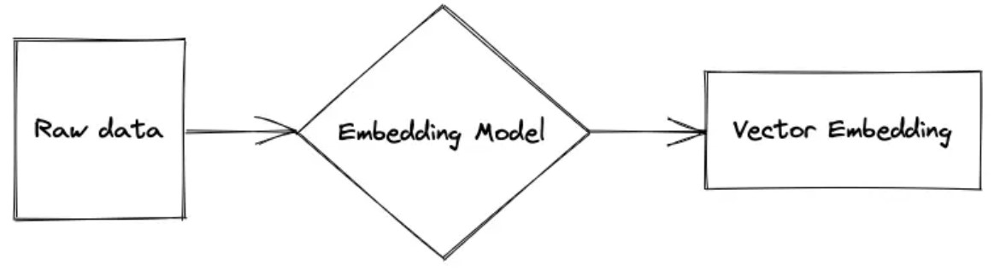

# Vector embeddings

> [Reference A](https://www.pinecone.io/learn/vector-embeddings-for-developers/)
> [Reference B](https://www.pinecone.io/learn/vector-embeddings/)

*Vector embeddings* is a pre-trained machine learning model applied to any data type that will produce a compact representation of it while preserving its meaning; it is represented as a vector. This representation makes it possible to translate *semantic similarity* as perceived by humans to proximity in a *vector space*. *Vector embedding* representations are thus suitable for common machine learning tasks such as clustering, recommendation, and classification.

To preserve the data’s meaning an *embedding model* understands and produces vectors where relationships between the vectors make sense. This *embedding model* is a neural network where the inputs are transformed with each layer of the network but the last layer is removed so instead of getting a labeled output the result is a *vector embedding*.

> An example of an embedding model is **word2vec**.

*Vector embeddings* can be applied to many domains. The applications can use *vector embeddings* as its query and can produce other *vector embeddings* which are similar to it with their corresponding values. Some examples are:

- Semantic search - the query is based on the semantic meaning not just keyword matching.
- Question-answering applications - to answer questions out of the original questions set
- Image search - different models handle different types of tasks like image similarity, object detection, and so on.
- Audio search - for applications like audio similarity search.
- Recommender Systems - data can be correlated to different entities such as products, articles, etc.
- Anomaly detection - for applications like anomalous occurrences identification.
